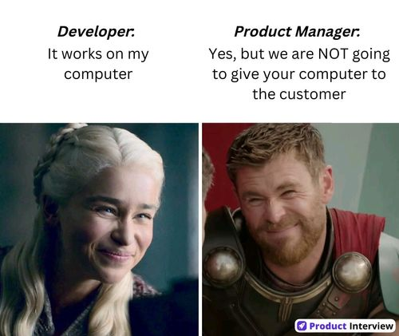

# 7월 8일(월) Day 5

## 수업

- Data product

  사용자(경영진,유저 등 권한이 있는 누군가)가 온전히 사용 할 수 있게 데이터와 필요한 모든 것들을 합쳐 놓은 데이터 자산.

  Product와 Project의 가장 큰 차이는 피드백을 받아서 반영 할 수 있는 라이플 사이클을 가졌는가 아닌가로 구분된다.

  작게 만들어서 빠른 피드백 루프를 갖는 것이 중요하다.
- 도커
  
  호스트 OS를 제외한 모든 것이 번들링 되어 배포 할 수 있게 하는 것이 약속이다.
- 병행성 : 멀티 프로세싱, 멀티 스레드

### KEEP

### PROBLEM

- Sentiment analysis를 할 때 전처리를 어디까지 해야하는지 궁금했다.
  단지 문법적으로 많이 쓰이는 특정 단어(about, to 등)는 전처리 과정에서 빼봐도 되지 않을까라는 생각을 처음에 했다.
  하지만 조금 더 고민해보니 내 맘대로 데이터를 바꾼다면 데이터 사용자가 왜곡된 결과를 받을 수 도 있을 것 같았다.
  데이터 전처리 과정도 사용하려는 사용자와 소통해가면서 정해야하는 것이고 빠른 피드백을 받는 것이 중요한 이유를 하나 더 찾았다고 생각한다.

### TRY
