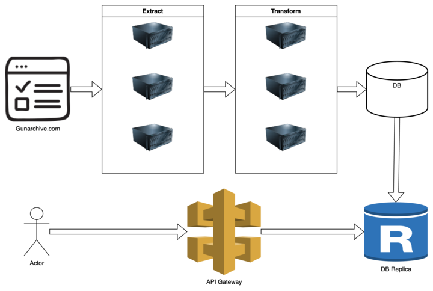
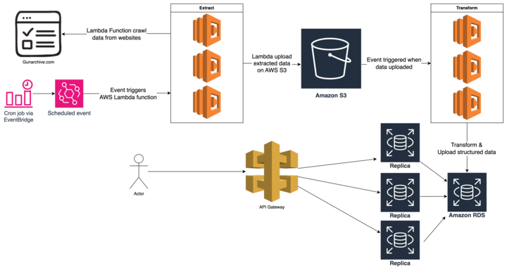

# 7월 25일(목)

## 리뷰

피드백을 받으며 작업을 계속 진행했다.
사건 정보(incident)에 대한 ETL 프로세스를 개발해 보라고 하셔서 경훈님과 소윤님이 각각 E와 TL 부분을 개발했다.
나는 시스템 아키텍처를 조금 더 개선하라는 피드백을 받아서 AWS 서비스들을 이용해 아키텍처를 구체화했다.

처음엔 이런 아키텍처를 그렸는데, ETL 프로세스는 기본적으로 필요할 때만 작업이 돌면 되기 때문에 서버를 사용 할
필요가 없다. 또, 작업 중간에 오류가 발생하면 재시작을 하기 위해 임시로 이전 단계의 결과를 저장 해놓을 곳이 필요했다.

개선된 아키텍처에서는 AWS 람다를 이용하여 작업이 있을 때만 ETL 프로세스가 돌아가게 했고, Extract의 결과를 S3에 업로드해서
Transform이 실패하더라도 재시도 할 수 있게 했다.

경훈님이 Extract 단계 개발에 애를 먹고 있어서 들여다 봤더니, 스크래핑 하려는 사이트가 한국 ip를 차단해놨다.
프록시 서버를 통해서 우회하려고 하시는데, 무료 프록시 서버는 잘 동작하지 않았다.
EC2 프리티어에 프록시 서버를 구축하는게 좋을 것 같다는 얘기를 드렸고 작업 중이다.

## 회고

개선된 아키텍처에서도 개선 할 부분이 여전히 있다. 먼저, AWS에 ETL을 도와주는 서비스가 AWS glue, EMR 같은
서비스가 있다. 내가 잘 모르는 서비스라 일단 아키텍처에 넣지는 않았지만 알아놔야 할 것 같다. 적재적소에 필요한
툴을 잘 써서 생산성을 높이는 것도 가치있는 일이라는 생각이 들었다.

두 번째로, 메시지 큐 서비스를 활용해서 재시도에 대한 로직을 추가 할 수 있을 것 같다. 현재는 AWS Event Bridge를
사용해 이벤트를 발행하여 ETL 프로세스를 실행한다. 따라서 중간에 ETl 프로세스가 중단되면 Event Bridge가 이벤트를
발행하기 전까지 기다려야 한다. 메시지 큐를 이용한다면 작업을 복구하는 프로세스를 추가 할 수 있을 것이다.

`시스템 아키텍처를 보고 필요한 작업들을 나누고 그룹핑하고 어떤 순서대로 구현하는 게 좋을지 계획을 짜 보세요.`

라는 질문을 받았는데, 이렇게 간단한 아키텍처를 갖고도 3명이 모두 다른 시각을 갖고 있었다.
내가 생각한 답을 팀원들에게 전달하는게 어려웠는데 다노님이 `데이터 자체의 획득 가능성을 먼저 확인해야 하니까`
라는 말 한마디로 정리했다. 장황하지 않고 고른 말을 사용해서 내 의사를 정확하게 표현하는 능력도 중요한 소프트
스킬이라는 것을 다시 한 번 느꼈다. 할 말을 생각하고 여유를 갖고 말을 하는 습관을 가져야 한다.

